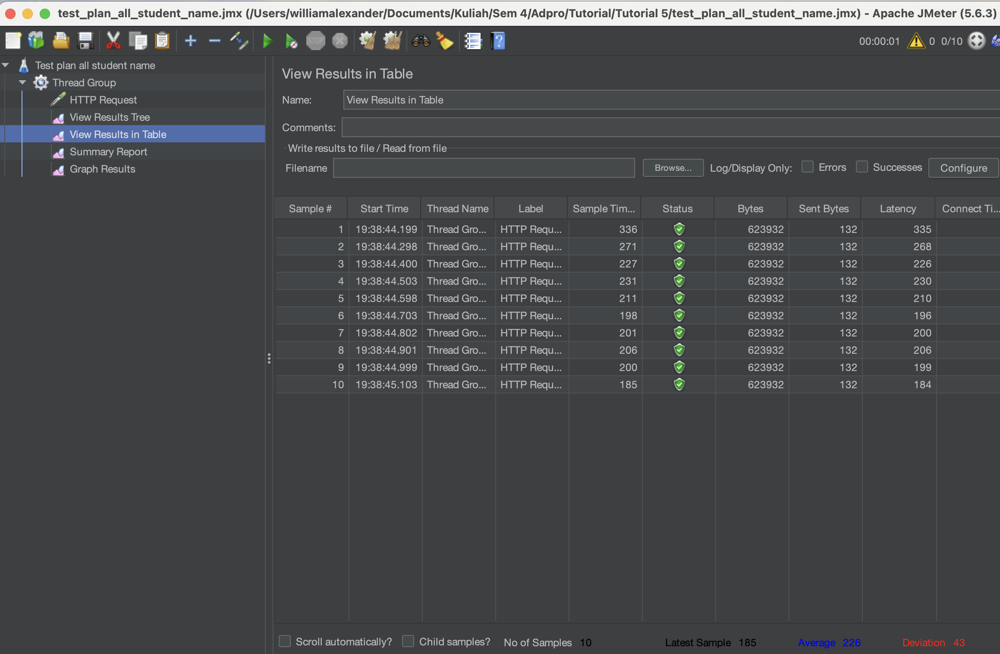
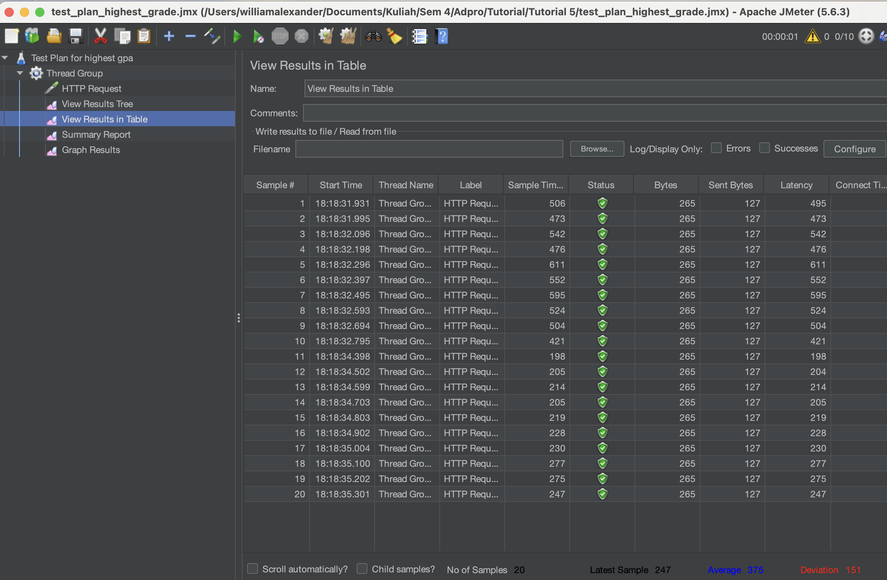
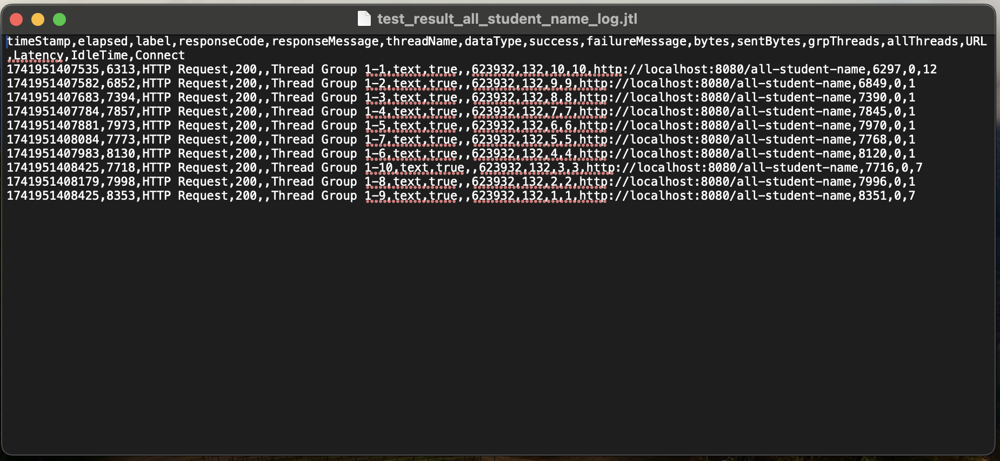
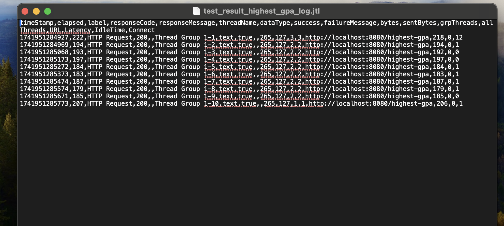

Screenshot Test Plan GUI:

Screenshot Test Plan Command Line:

After the profiling and performance optimization process is completed, perform a performance test again using JMeter, see the results, and compare with the first measurement. Is there an improvement from JMeter measurements?

Terdapat peningkatan performa yang dapat dilihat dari kecepatan waktu sample time nya. Kemudian, sebelum optimized, pada request /all-student di JMeter statusnya error semua dan setelah dioptimized tidak ada lagi error. 

**REFLECTION**
1. What is the difference between the approach of performance testing with JMeter and profiling with IntelliJ Profiler in the context of optimizing application performance?

JMeter dapat mengukur performa aplikasi yang kita buat dengan berbagai metrik seperti view result tree, view result in table, summary report, dll namun tidak memberikan feedback dari bagian kode mana yang membuat lambat atau kurang baik. Sedangkan, IntelliJ Profiler dapat memberikan kita feedback semisal call tree dan method list yang memberi tahu kita bagian kode kita yang mana yang menyebabkan lambatnya jalannya kode.

2. How does the profiling process help you in identifying and understanding the weak points in your application?

Proses profiling membantu dalam mengidentifikasi titik lemah dalam aplikasi yang biasanya berupa bagian kode atau method mana yang menyebabkan aplikasi berjalan lambat dan tidak efisien. Kita juga dapat tahu penggunaan CPU yang tinggi, yang mungkin disebabkan oleh perulangan yang tidak efisien atau algoritma yang kurang optimal.
    
3. Do you think IntelliJ Profiler is effective in assisting you to analyze and identify bottlenecks in your application code?

Ya, dalam tutorial ini saya jadi mengetahui dimana method yang menyebabkan kode berjalan lambat dengan cepat tanpa perlu melakukan debug secara manual yang melelahkan.

4. What are the main challenges you face when conducting performance testing and profiling, and how do you overcome these challenges?

Tantangannya adalah mengidentifikasi bottleneck itu sendiri, terkadang yang menjadi bottleneck tidak selalu bagian kode yang berjalan paling lama. Bisa jadi suatu method sudah dalam bentuk paling optimized dengan waktu eksekusi yang lambat, namun method lain kurang optimized saat jalannya lebih cepat. Hal ini saya temukan saat mencoba mengoptimize /highest-gpa, dimana saya mencari cara untuk mengoptimize pencarian gpa max, namun ternyata yang menjadi bottleneck adalah method yang mereturn list semua student(studentRepository.findAll()).

5. What are the main benefits you gain from using IntelliJ Profiler for profiling your application code?

Menggunakan IntelliJ Profiler membantu kita menemukan bagian kode yang lambat, mengukur penggunaan CPU dan memori, serta melihat alur eksekusi kode. Ini memudahkan kita mengidentifikasi masalah seperti memory leak atau algoritma yang tidak efisien, sehingga kita bisa memperbaiki kinerja aplikasi dengan lebih tepat dan cepat.

6. How do you handle situations where the results from profiling with IntelliJ Profiler are not entirely consistent with findings from performance testing using JMeter?

Jika hasil profiling dengan IntelliJ Profiler tidak konsisten dengan temuan dari pengujian JMeter, kita harus memastikan environment pengujiannya sama dan periksa apakah overhead dari profiling memengaruhi hasil. JMeter fokus pada pengujian beban eksternal (response time, throughput), sementara IntelliJ Profiler mengukur penggunaan sumber daya internal (CPU, memori, thread), jadi hasil keduanya bisa berbeda.

7. What strategies do you implement in optimizing application code after analyzing results from performance testing and profiling? How do you ensure the changes you make do not affect the application's functionality?

Strateginya adalah dengan mengimplementasikan ulang kode yang tidak efisien dengan algoritma yang lebih efisien. Atau jika bisa, menggunakan struktur data tertentu yang bisa membuat jalannya kode lebih efisien dan tidak memakan memori terlalu banyak. Agar fungsionalitas tetap terjaga, kita harus menggunakan unit test dan functional test dan pastikan optimized code kita tetap berhasil melewati unit test dan functional test tersebut.